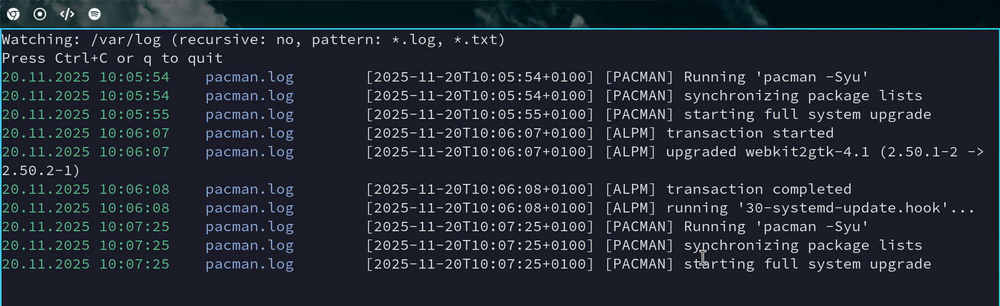

# logwat

Tail multiple log files with a fast, lightweight terminal UI. Point it at a directory and see new lines as they arrive, with filtering, include/exclude globs, per-file pane, pause/resume, search, selection/yank, severity highlighting, deduplication, and more.



## Requirements
- Go 1.24+
- Linux, macOS, or Windows (paths render with backslashes on Windows for readability).

## Build
Option A — standard Go build:
```
go build -o logwat .
```

Option B — helper scripts:
- Linux: `./build-linux.sh`
- Windows: `./build-win.sh`

## Usage
```
logwat <directory[;directory2[;...]]> [pattern_globs] [--recursive|-r] [--max-lines N] [--utc] [--include globs] [--exclude globs]
```

Flags and arguments:
- directory: root folder to watch. You can pass multiple root folders by separating them with `;` (semicolon), e.g. `/var/log;/opt/app/logs`. Files from all these roots will be added to the watcher.
- pattern_globs: optional comma-separated globs used for initial matching and banner (e.g., `"*.log,*.txt"`). If omitted, defaults to `*.log,*.txt` unless you pass `--include`.
- --recursive, -r: watch directories recursively (default: true).
- --max-lines N: maximum lines retained in the viewport buffer (default: 5000).
- --utc: render timestamps in UTC.
- --include globs: comma-separated include globs matched against relative path or base name.
- --exclude globs: comma-separated exclude globs matched against relative path or base name.

Examples:
```
# Simple: watch everything under /var/log
logwat /var/log

# Watch logs recursively with custom buffer size
logwat /var/log --recursive --max-lines 10000

# Use initial pattern globs (legacy/compat behavior)
logwat /var/log "*.log,*.txt"

# Use include/exclude with globbing on relative paths and basenames
logwat /var/log --include "**/*.log,*.txt" --exclude "**/archive/*,*.bak"

# Watch multiple roots (semicolon-separated)
logwat /var/log;/opt/app/logs --include "**/*.log"

# Windows example
logwat "C:/ProgramData/Microsoft/IntuneManagementExtension/Logs" "*.log" --recursive
```

## Features
- Include/Exclude globs: filter which files to watch using `--include` and `--exclude`.
- Per-file pane: toggle a right-side pane listing active files; jump to a specific file’s lines.
- Live filtering: type `/` to edit a live text filter applied to the viewport (see Keybindings).
- Pause/Resume: hit Space to pause; optionally step through queued lines with `j`/`k` while paused.
- Search matches: after entering a filter, jump to next/previous match with `n`/`N`.
- Selection and Yank: visually select lines then yank to clipboard and auto-save the selection to a temp file.
- Multi-line grouping and deduplication: group continuations and collapse duplicates with counts; toggle expanded view.
- Severity detection and highlighting: common level keywords are colorized for quick scanning.
- Cross-platform paths: Windows paths are shown with backslashes for readability.

## Keybindings
- q or Ctrl+C: quit
- Space: pause/resume; while paused, use `j`/`k` to step through queued items
- p: toggle side pane (file list)
- 1–9: when pane is visible, jump to the Nth file in the pane
- 0: when pane is visible, clear file filter (show all files)
- /: start editing the live filter; Enter applies, Esc clears and exits
- n / N: jump to next / previous match (when a filter is active)
- v: start/end visual selection
- y: yank selected lines (copy to clipboard if available) and save to a temp file; a status line shows the path
- e: expand/collapse grouped entries (show/hide wrapped/continuation lines)

## Notes
- Globs match against both the relative path (from the root directory you pass) and the base filename.
- When multiple roots are provided, each file’s path is shown relative to its root, prefixed by the root directory’s base name to avoid ambiguity (e.g., `var/log/syslog` vs `opt/app/logs/app.log`).
- Recursive watching is enabled by default; you can explicitly pass `--recursive` or `-r` for clarity.
- If no `pattern_globs` or `--include` are provided, the default patterns are `*.log, *.txt`.
- Timestamps can be shown in local time (default) or UTC via `--utc`.

## Demo logs
There are a few small demo files under `demo-logs/`. You can also generate activity with your own processes or using the test script under `tests/`.

## Test helper
```
./tests/simulate_logs.sh
```
Writes a handful of sample lines into rotating files to demonstrate tailing, grouping, and filtering.